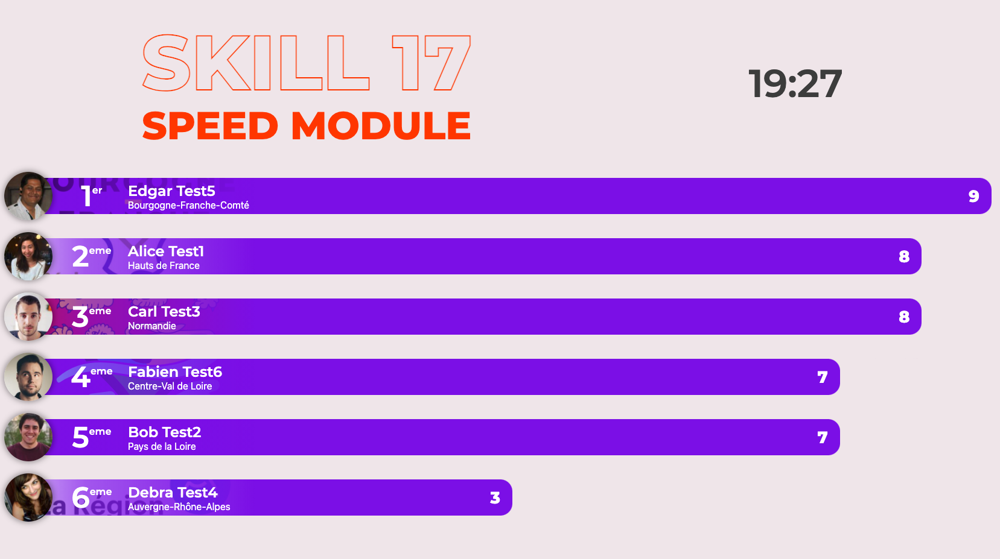

# Tests automatisés aux finales nationales 2022

## Test d'API (Module C2)
Pour le module C2, les spécifications de l'API seront fournies dans la spécification OpenAPI.  

Les tests utilisent PHPUnit et vont procéder de la sorte :
  - Ils nettoient la base de données, et la remplissent avec des données de test (le fichier SQL fourni dès le début du module). Il ne faut donc pas toucher à la structure de la BDD.
  - Ils appellent, dans un ordre bien précis, les différentes routes de l'API, dans le but de tester aussi les effets de bord (par exemple, tester par une requête GET que l'élément créé juste avant avec la requête POST est présent et bien formé).
  - Pour chacune des routes, plusieurs tests sont lancés :
    - Le fonctionnement avec des données correctes
    - Le fonctionnement avec des données incorrectes (pour tester la validation)
    - Les codes HTTP de retour
    - Les headers de retour
    - Le format de la réponse : tous les champs sont présents, le tri est fait par date, ...
    - ...

    Chacun de ces tests est indépendant.
  - Ces tests vous seront fournis pendant le module, sans le nombre de points associés.
  - Les jurés auront les mêmes tests, avec d'autres données, ceci afin de s'assurer que rien n'est renvoyé en dur.

Ces tests peuvent être lancés depuis un répertoire externe, car on teste l'API en elle-même et pas le code.

## Tests unitaires - Jest et PHPUnit (Speed-Module)
Ces tests sont directement intégrés au répertoire du code, car ils testent directement des fonctions. Dans le cadre du speed-module, ils vont être lancés à intervalles réguliers par un programme externe qui fera le lien avec le tableau des scores :

De la même manière, une version est présente dans le répertoire, et une version étendue est présente sur l'outil et pour les jurés, pour exclure les retours en dur dans le code. Ces deux versions incluent les fonctions présentes de base dans le fichier, d'où l'importance de ne pas changer leur nom !

## Tests par navigateur headless (utilisant Cypress)
Ces tests permettront d'évaluer des tâches HTML/CSS du speed-module, notamment par le biais de fonctions du type `cy.get(mainMenu).should('have.css', 'height', '500px')` voire de la comparaison de screenshots.

TODO: mettre des exemples dans ce repo